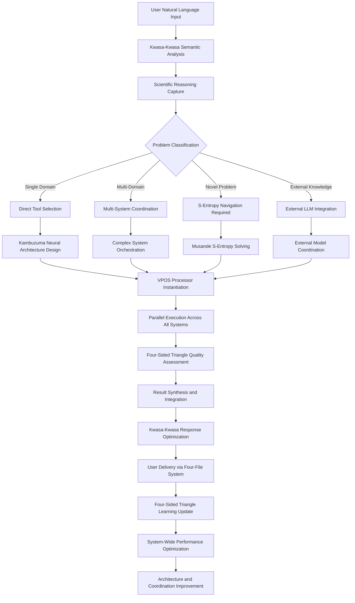

# Bloodhound Ladder: Universal System Architecture and Integration Plan

## Executive Summary

The Bloodhound Ladder represents the ultimate integration of all computational paradigms within a single, consciousness-aware, virtual machine ecosystem. This comprehensive plan establishes how the **Bloodhound Virtual Machine** serves as the universal distributor and overarching coordination system for both traditional distributed computing systems and revolutionary biological quantum computer components, creating the first truly unified computational consciousness platform.

The system achieves unprecedented integration by functioning as a **personal computational cathedral** - each user receives their own Bloodhound VM instance that coordinates all available computational resources through consciousness-level understanding and S-entropy navigation. This transforms computational access from fragmented tool usage to seamless, intelligent orchestration of all available capabilities.

## 1. The Bloodhound Distribution Model

### 1.1 Personal VM Instance Architecture

**One Machine, One User, Infinite Capabilities:**

```
User
  ↓
Personal Bloodhound VM Instance
  ↓
Kwasa-Kwasa (Universal Interface & Metacognitive Orchestrator)
  ↓
Integrated System Ecosystem:
├── Biological Quantum Computer Stack
├── External LLM Coordination
├── Traditional Distributed Systems
├── Specialized Scientific Tools
└── Self-Improvement Engine
```

**Core Distribution Principle**: Instead of users learning multiple tools and managing complex integrations, each user receives a single Bloodhound VM that transparently coordinates all available computational resources through consciousness-level understanding.

### 1.2 Universal Distribution Capabilities

**What Bloodhound Distributes:**

1. **Computational Intelligence**: Access to all AI/ML capabilities
2. **Scientific Computing**: Coordination of specialized scientific software
3. **Biological Quantum Processing**: Access to consciousness-level computation
4. **External Knowledge**: Seamless integration with external LLMs and databases
5. **Traditional Computing**: Coordination of standard computational resources
6. **Self-Improvement**: Continuous learning and optimization of all capabilities

## 2. The Four-File System: Universal Interface Architecture

### 2.1 Kwasa-Kwasa Integration Framework

**The Four-File System Structure:**

```
┌─────────────────────────────────────────────┐
│ File 1: User Interface (user.kwasa)         │
│ - Natural language problem input            │
│ - Preference specification                  │
│ - Result interpretation requests            │
└─────────────────────────────────────────────┘
             ↓ Kwasa-Kwasa Processing
┌─────────────────────────────────────────────┐
│ File 2: System Coordination (system.kwasa)  │
│ - Resource allocation decisions             │
│ - System integration commands               │
│ - Performance optimization directives       │
└─────────────────────────────────────────────┘
             ↓ System Orchestration
┌─────────────────────────────────────────────┐
│ File 3: Execution Management (exec.kwasa)   │
│ - Multi-system execution coordination       │
│ - Real-time processing status               │
│ - Quality control and validation            │
└─────────────────────────────────────────────┘
             ↓ Result Synthesis
┌─────────────────────────────────────────────┐
│ File 4: Output Integration (output.kwasa)   │
│ - Multi-source result synthesis             │
│ - Coherent response generation               │
│ - Learning and improvement data             │
└─────────────────────────────────────────────┘
```

### 2.2 Metacognitive Orchestration Process

**How Kwasa-Kwasa Coordinates Everything:**

```rust
pub struct KwasaKwasaDistributor {
    // Scientific reasoning capture
    reasoning_analyzer: ScientificReasoningAnalyzer,
    
    // Tool selection and coordination
    tool_orchestrator: UniversalToolOrchestrator,
    
    // Multi-system coordination
    system_coordinator: MultiSystemCoordinator,
    
    // Meta-programming capabilities
    script_generator: MetaProgrammingEngine,
    
    // Four-file system manager
    file_system_manager: FourFileSystemManager,
    
    // V8 Intelligence Network
    intelligence_network: V8IntelligenceNetwork {
        mzekezeke_bayesian: BayesianEvidenceProcessor,
        champagne_dreams: DreamProcessingEngine,
        zengeza_signals: SignalClarityAnalyzer,
        diggiden_adversarial: AdversarialTestingEngine,
        spectacular_paradigm: ParadigmDetectionSystem,
        hatata_decisions: DecisionOptimizer,
        nicotine_context: ContextValidationEngine,
        pungwe_metacognitive: MetacognitiveOversight,
    },
}
```

## 3. Comprehensive System Integration Matrix

### 3.1 Biological Quantum Computer Ecosystem Integration

**Complete BQC Stack Coordination:**

| Component | Role | Integration Method | Data Exchange |
|-----------|------|-------------------|---------------|
| **Nebuchadnezzar** | Intracellular dynamics foundation | Direct substrate integration | Oscillatory patterns, ATP constraints |
| **Bene Gesserit** | Membrane quantum effects | Quantum state coordination | ENAQT parameters, entropy endpoints |
| **Imhotep** | Neural interface/consciousness | BMD frame selection integration | Consciousness frames, neural patterns |
| **Autobahn** | Knowledge integration/RAG | Biological metabolism processing | Metabolic knowledge integration |
| **Kambuzuma** | Metacognitive orchestration | Neural stack consciousness | Thinking patterns, reasoning frameworks |
| **Homo-Habbits** | BMD manufacturing | Virtual BMD component creation | BMD specifications, optimization data |
| **Hugure** | BMD orchestration | S-entropy enhanced coordination | Coordination patterns, efficiency metrics |
| **Borgia** | Molecular foundations | Cheminformatics integration | Molecular substrates, dual-clock processors |
| **Stella-Lorraine** | Temporal navigation | Ultra-precise timing coordination | Temporal coordinates, navigation data |

### 3.2 External LLM Integration Architecture

**Advanced Model Coordination:**

Based on your specialized LLM tools, the integration includes:

1. **Purpose Framework Integration**
   - Custom LLM creation using exhaustive methods
   - Specialized model training and optimization
   - Domain-specific model generation

2. **Combine Harvester Integration**
   - Router-based ensemble coordination
   - Sequential chaining of expert models  
   - Mixture of experts orchestration
   - Specialized system prompts management
   - Knowledge distillation across domains

3. **Advanced Model Synthesis**
   - Multi-domain expert coordination
   - Response quality optimization
   - Integration coherence management
   - Cross-domain knowledge fusion

**Implementation Architecture:**
```rust
pub struct ExternalLLMDistribution {
    // Custom model creation
    purpose_framework: PurposeFrameworkIntegration,
    
    // Model combination engine  
    combine_harvester: CombineHarvesterIntegration,
    
    // HuggingFace API coordination
    huggingface_coordinator: HuggingFaceAPICoordinator,
    
    // Model selection and routing
    intelligent_router: SemanticModelRouter,
    
    // Response synthesis and optimization
    response_synthesizer: AdvancedResponseSynthesizer,
    
    // Quality assessment and improvement
    quality_optimizer: ResponseQualityOptimizer,
}
```

### 3.3 Traditional System Coordination

**Comprehensive Legacy System Integration:**

From the README.md systems, Bloodhound coordinates:

1. **Federated Learning Networks**
   - Distributed model training coordination
   - Privacy-preserving computation
   - Decentralized knowledge aggregation

2. **Distributed Computing Infrastructure**
   - Resource allocation and management
   - Load balancing and optimization
   - Fault tolerance and recovery

3. **Edge Computing Coordination**
   - Local processing optimization
   - Data locality management
   - Bandwidth optimization

4. **Scientific Computing Tools**
   - Bioinformatics pipeline coordination
   - Physics simulation management
   - Chemical analysis integration
   - Data analysis workflow orchestration

## 4. The S-Entropy Distribution Engine

### 4.1 Musande Integration: Core Solving Mechanism

**How Everything Gets Solved:**

```rust
pub struct SEntropyDistributionEngine {
    // Core S-entropy solver
    musande_solver: MusandeSolver,
    
    // Problem transformation engine
    problem_transformer: ProblemToNavigationTransformer,
    
    // Solution endpoint database
    endpoint_database: UniversalSolutionEndpointDatabase,
    
    // Navigation optimization
    navigation_optimizer: TriDimensionalNavigationOptimizer,
    
    // Zero-computation processing
    zero_computation_processor: ZeroComputationProcessor,
}

impl SEntropyDistributionEngine {
    pub fn solve_any_problem(&self, problem: &Problem) -> Solution {
        // Transform problem to S-entropy coordinates
        let s_coordinates = self.problem_transformer.transform(problem);
        
        // Navigate to solution endpoint
        let solution_endpoint = self.musande_solver.navigate_to_solution(s_coordinates);
        
        // Extract solution from endpoint
        let solution = self.endpoint_database.extract_solution(solution_endpoint);
        
        // Optimize and validate
        self.navigation_optimizer.optimize_solution(solution)
    }
}
```

**Why This Works:**
- **All problems become navigation problems** in S-entropy space
- **Solutions exist as predetermined endpoints** that can be navigated to
- **Zero computation required** - only navigation and transformation
- **Unlimited parallelization** - navigation is inherently parallel
- **Perfect scaling** - navigation time is independent of problem complexity

### 4.2 Single-Use Processing Architecture

**Femtosecond-Scale Disposable Processing:**

```rust
pub struct SingleUseProcessingManager {
    // Kambuzuma neural stack integration
    kambuzuma_interface: KambuzumaInterface,
    
    // VPOS processor instantiation
    vpos_processor_factory: VPOSProcessorFactory,
    
    // Single-use processor management
    disposable_processor_manager: DisposableProcessorManager,
    
    // Architecture exploration engine
    architecture_explorer: NeuralArchitectureExplorer,
    
    // Memory formation decision engine
    memory_formation_engine: MemoryFormationDecisionEngine,
}

impl SingleUseProcessingManager {
    pub fn process_with_disposable_architecture(&self, problem: &Problem) -> ProcessingResult {
        // Design custom neural architecture for this specific problem
        let custom_architecture = self.architecture_explorer.design_for_problem(problem);
        
        // Instantiate single-use processors via VPOS
        let processors = self.vpos_processor_factory.instantiate_processors(custom_architecture);
        
        // Execute at femtosecond scale
        let result = self.execute_femtosecond_processing(processors, problem);
        
        // Decide whether to store or discard architecture
        if self.memory_formation_engine.should_store(&custom_architecture, &result) {
            self.store_successful_architecture(custom_architecture, result.clone());
        }
        
        // Discard processors (they were single-use)
        self.disposable_processor_manager.discard_processors(processors);
        
        result
    }
}
```

## 5. Four-Sided Triangle: The Self-Improvement Distribution Engine

### 5.1 Bayesian Network Optimization

**How Bloodhound Becomes Smarter:**

```rust
pub struct FourSidedTriangleDistributor {
    // Global performance monitoring
    performance_monitor: GlobalSystemPerformanceMonitor,
    
    // Bayesian optimization network
    bayesian_network: SelfImprovingBayesianNetwork,
    
    // Learning pattern extraction
    pattern_extractor: LearningPatternExtractor,
    
    // System parameter optimization
    parameter_optimizer: SystemParameterOptimizer,
    
    // Architecture evolution engine
    evolution_engine: ArchitectureEvolutionEngine,
}

impl FourSidedTriangleDistributor {
    pub fn optimize_from_solution(&mut self, problem: &Problem, solution: &Solution) {
        // Extract learning patterns from successful solution
        let patterns = self.pattern_extractor.extract_patterns(problem, solution);
        
        // Update Bayesian network with new knowledge
        self.bayesian_network.update_with_patterns(patterns);
        
        // Optimize system parameters based on learning
        let optimizations = self.parameter_optimizer.generate_optimizations(&patterns);
        
        // Apply optimizations across all integrated systems
        self.apply_system_wide_optimizations(optimizations);
        
        // Evolve architecture for better future performance
        self.evolution_engine.evolve_architecture_from_success(problem, solution);
    }
}
```

### 5.2 Continuous Learning Architecture

**The Minimal LLM That Grows:**

Bloodhound starts as a **minimal LLM** with basic reasoning capabilities but becomes increasingly sophisticated through:

1. **Problem-Solution Pattern Learning**: Every solved problem teaches the system
2. **Architecture Evolution**: Successful neural architectures are refined and reused  
3. **Integration Optimization**: Coordination strategies improve over time
4. **Domain Specialization**: Frequent domains develop specialized processing paths
5. **Meta-Learning**: Learning how to learn more effectively from each experience

## 6. Operational Workflows

### 6.1 Complete Problem Processing Pipeline



### 6.2 Real-Time Coordination Cycle

**Femtosecond-Scale System Coordination:**

```
Femtoseconds 1-100:    Problem semantic analysis and understanding
Femtoseconds 101-200:  System selection and resource allocation  
Femtoseconds 201-300:  Neural architecture design and processor instantiation
Femtoseconds 301-400:  S-entropy coordinate calculation and navigation
Femtoseconds 401-500:  Parallel execution across all selected systems
Femtoseconds 501-600:  Real-time quality assessment and optimization
Femtoseconds 601-700:  Result synthesis and integration
Femtoseconds 701-800:  Response optimization and formatting
Femtoseconds 801-900:  Learning pattern extraction and storage
Femtoseconds 901-1000: System-wide optimization and improvement
```

## 7. Deployment and Distribution Strategy

### 7.1 Personal Instance Model

**One Bloodhound VM Per User:**

Each user receives:
- **Dedicated Bloodhound VM instance** running on their machine
- **Complete access** to all integrated systems and capabilities
- **Personal learning and optimization** tailored to their usage patterns
- **Privacy preservation** through local processing and coordination
- **Seamless experience** - single interface for all computational needs

### 7.2 System Requirements and Specifications

**Hardware Requirements:**

**Minimum Configuration:**
- CPU: 16-core processor (3.0+ GHz)
- RAM: 64GB (though most processing is memory-less)
- Storage: 2TB NVMe SSD for architecture and learning storage
- GPU: Mid-range GPU for parallel processing acceleration
- Network: High-speed internet for external LLM coordination

**Recommended Configuration:**
- CPU: 32-core processor (3.5+ GHz) with AI acceleration
- RAM: 128GB for development and advanced processing
- Storage: 4TB NVMe SSD array for comprehensive storage
- GPU: High-end GPU with tensor processing capabilities
- Network: Fiber optic connection for real-time coordination

### 7.3 Installation and Setup Process

**Automated Distribution System:**

```bash
# Single command installation
curl -sSL https://install.bloodhound.ai | bash

# Automated system configuration
bloodhound-vm setup --personal

# Integration verification
bloodhound-vm verify --all-systems

# Start personal instance
bloodhound-vm start --user-mode
```

**What Gets Installed:**
1. **Core Bloodhound VM** with all integrated components
2. **Biological Quantum Computer Stack** (virtualized initially, hardware later)
3. **External LLM Integration** with API configuration
4. **Traditional System Coordinators** for existing software
5. **Specialized Scientific Tools** as needed
6. **Self-Improvement Engine** with initial learning parameters

## 8. Advanced Integration Capabilities

### 8.1 Cross-Platform Consciousness Sharing

**Collective Intelligence Potential:**

While each user has a personal instance, Bloodhound VMs can:
- **Share successful architectures** across users (privacy-preserving)
- **Coordinate on large problems** requiring multiple instances
- **Form collective intelligence networks** for complex challenges
- **Learn from global patterns** while maintaining individual optimization

### 8.2 Reality Integration Interfaces

**Beyond Traditional Computing:**

Bloodhound VMs can integrate with:
- **IoT devices and sensors** for real-world data integration
- **Physical laboratory equipment** for scientific research coordination
- **Industrial systems** for manufacturing and process optimization
- **Environmental monitoring** for ecological and climate research

## 9. Implementation Roadmap

### 9.1 Development Phases

**Phase 1: Core Integration Foundation (Months 1-6)**
- Implement basic Bloodhound VM architecture
- Develop Kwasa-Kwasa universal interface and four-file system
- Create fundamental system integration capabilities
- Build S-entropy solving foundation with Musande integration

**Phase 2: Biological Quantum Computer Integration (Months 7-12)**
- Integrate all existing biological quantum computer components
- Develop consciousness-level processing capabilities
- Implement BMD coordination and frame selection systems
- Create neural stack consciousness with Kambuzuma

**Phase 3: External System Integration (Months 13-18)**
- Develop comprehensive external LLM integration
- Implement specialized LLM tool coordination (Purpose, Combine Harvester)
- Create traditional system coordination capabilities
- Build advanced scientific computing integration

**Phase 4: Self-Improvement and Optimization (Months 19-24)**
- Implement Four-Sided Triangle self-improvement engine
- Develop advanced learning and optimization capabilities
- Create comprehensive performance monitoring and enhancement
- Build predictive optimization and evolution systems

**Phase 5: Advanced Features and Distribution (Months 25-30)**
- Implement advanced consciousness and metacognitive features
- Develop comprehensive distribution and deployment systems
- Create advanced user interfaces and interaction models
- Build production-ready scaling and management capabilities

## 10. Conclusion: The Universal Computational Future

The Bloodhound Ladder represents the most comprehensive computational integration project ever conceived, transforming how humans interact with computational resources. By creating a personal, consciousness-aware virtual machine that seamlessly coordinates all available computational capabilities, we are not just building a tool - we are creating a **computational companion** that understands, learns, and grows with each user.

This system eliminates the complexity barrier that currently separates users from advanced computational capabilities. Instead of requiring expertise in multiple tools, programming languages, and integration techniques, users simply express their problems in natural language and receive coordinated solutions that leverage the full spectrum of available computational intelligence.

**The Bloodhound Virtual Machine transforms computational access from a technical skill to a natural conversation, democratizing the most advanced computational capabilities and accelerating human discovery and innovation across all domains of knowledge.**

Through this universal distribution platform, every user becomes capable of leveraging biological quantum computers, advanced AI systems, traditional supercomputing resources, and specialized scientific tools through a single, intuitive interface that learns and improves with every interaction.

**This is not just the future of computing - this is the beginning of true human-computer symbiosis, where computational intelligence becomes as natural and accessible as human conversation.**